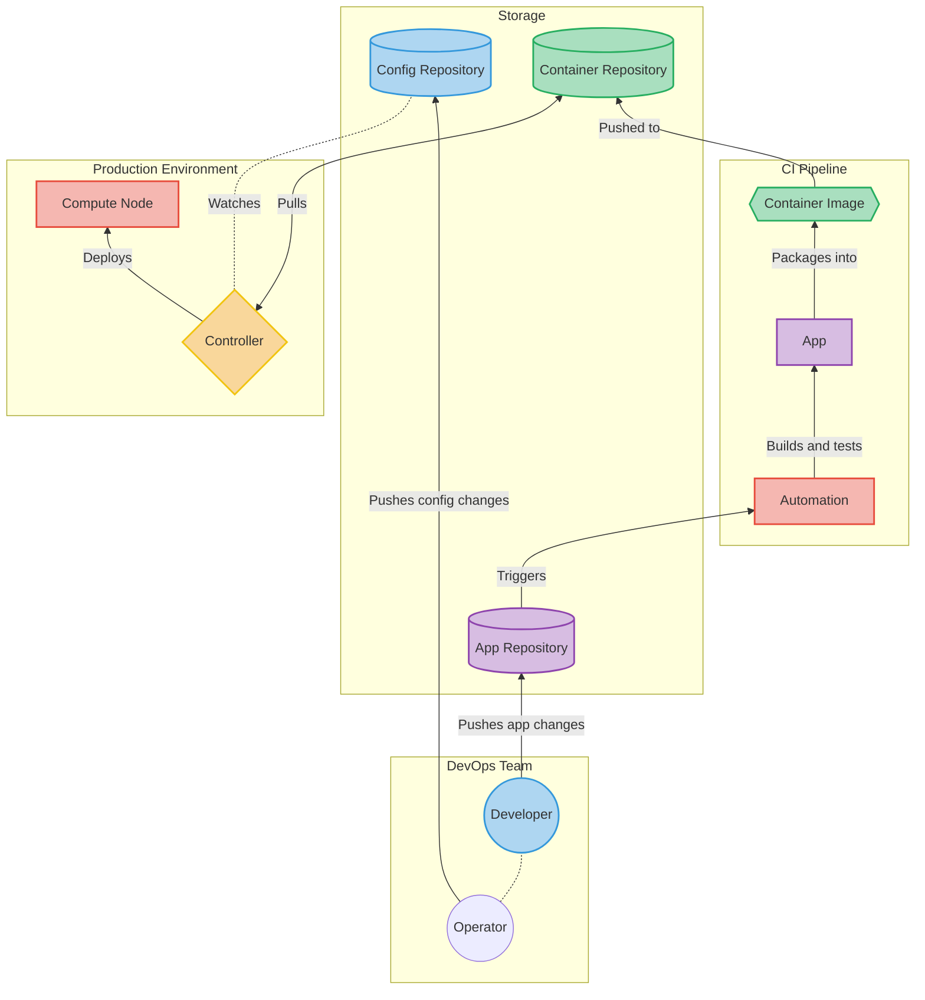

## GitOps Principles [v1.0.0](https://github.com/open-gitops/documents/releases/tag/v1.0.0)

1. 1
   
   ### Declarative
   
   A [system](https://github.com/open-gitops/documents/blob/v1.0.0/GLOSSARY.md#software-system) managed by GitOps must have its desired state expressed [declaratively](https://github.com/open-gitops/documents/blob/v1.0.0/GLOSSARY.md#declarative-description).

2. 2
   
   ### Versioned and Immutable
   
   Desired state is [stored](https://github.com/open-gitops/documents/blob/v1.0.0/GLOSSARY.md#state-store) in a way that enforces immutability, versioning and retains a complete version history.

3. 3
   
   ### Pulled Automatically
   
   Software agents automatically pull the desired state declarations from the source.

4. 4
   
   ### Continuously Reconciled
   
   Software agents [continuously](https://github.com/open-gitops/documents/blob/v1.0.0/GLOSSARY.md#continuous) observe actual system state and [attempt to apply](https://github.com/open-gitops/documents/blob/v1.0.0/GLOSSARY.md#reconciliation) the desired state.

