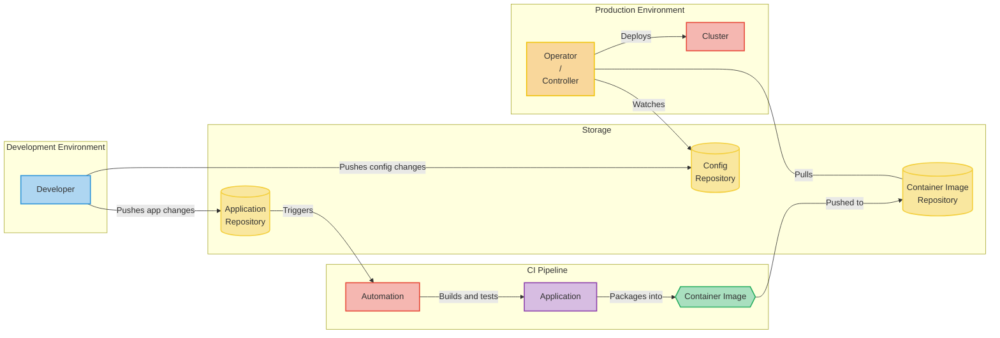

# :recycle: GitOps 
> https://opengitops.dev/

```mermaid

graph LR
    style O fill:#f9d79b,stroke:#f1c40f,stroke-width:2px,color:#333
    style D fill:#aed6f1,stroke:#3498db,stroke-width:2px,color:#333
    style CI fill:#f5b7b1,stroke:#e74c3c,stroke-width:2px,color:#333
    style A fill:#d7bde2,stroke:#8e44ad,stroke-width:2px,color:#333
    style I fill:#a9dfbf,stroke:#27ae60,stroke-width:2px,color:#333
    style GA fill:#f9e79f,stroke:#f4d03f,stroke-width:2px,color:#333
    style GC fill:#f9e79f,stroke:#f4d03f,stroke-width:2px,color:#333
    style R fill:#f9e79f,stroke:#f4d03f,stroke-width:2px,color:#333
    style K fill:#f5b7b1,stroke:#e74c3c,stroke-width:2px,color:#333

    subgraph "Production Environment"
       O -->|Deploys| K[Cluster]
    end

    subgraph "Development Environment"
        D[Developer]
    end

    subgraph "CI Pipeline"
        CI -->|Builds and tests| A[Application]
        A -->|Packages into| I
    end

    subgraph "Storage"
        GA[(Application \n Repository)]
        GC[(Config \n Repository)]
        R[(Container Image \n  Repository)]
    end

O ------|Pulls| R
GA -->|Triggers| CI[Automation]

I{{Container Image}} ---->|Pushed to| R
D[Developer] -->|Pushes app changes| GA
D -->|Pushes config changes| GC
O[Operator \n / \n Controller] -->|Watches| GC
```
